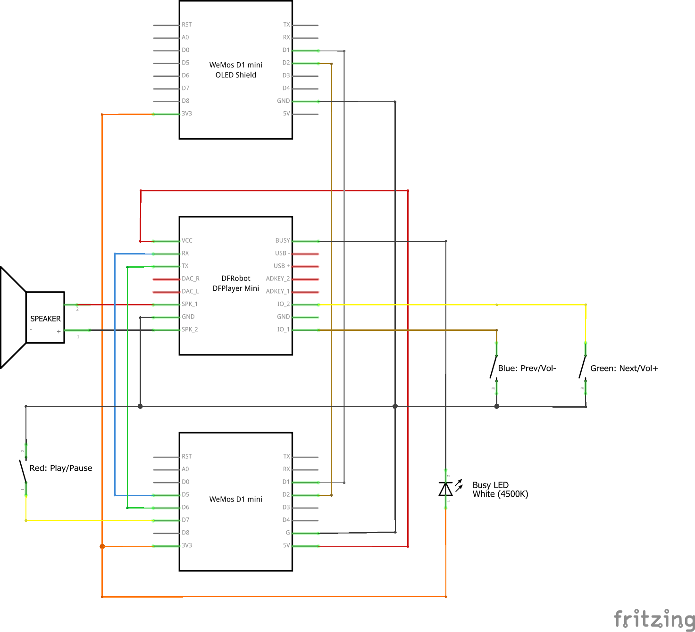

# Arduino MP3 Alarm Clock

An ESP8266 microcontroller-based network connected alarm clock that plays MP3 music from a microSD card.

This project is based on my previous [Arduino Music Player](https://github.com/balassy/music-player) project which contains more detailed description about how it works.

## Wiring

Note that the DFPlayer Mini is powered from the 5V output of the Wemos D1 Mini. According to the DFPlayer datasheet the board should be able to operate from 3.3V too, but in my experience it does not work.

## Required libraries

Install the following libraries with the Arduino Library Manager to compile this project:
- `OneButton` by Matthias Hertel (https://github.com/mathertel/OneButton)
- `WiFiManager` by tzapu (https://github.com/tzapu/WiFiManager.git)
- `Adafruit SSD1306 Wemos Mini OLED` by Adafruit + mcauser (https://github.com/stblassitude/Adafruit_SSD1306_Wemos_OLED)
- `DFRobotDFPlayerMini` library by DFRobot (https://github.com/DFRobot/DFRobotDFPlayerMini), MP3 source: https://www.101soundboards.com/
- `ezTime` by Rop Gonggrijp (https://github.com/ropg/ezTime)

## About the author

This project was created by [György Balássy](https://linkedin.com/in/balassy).
